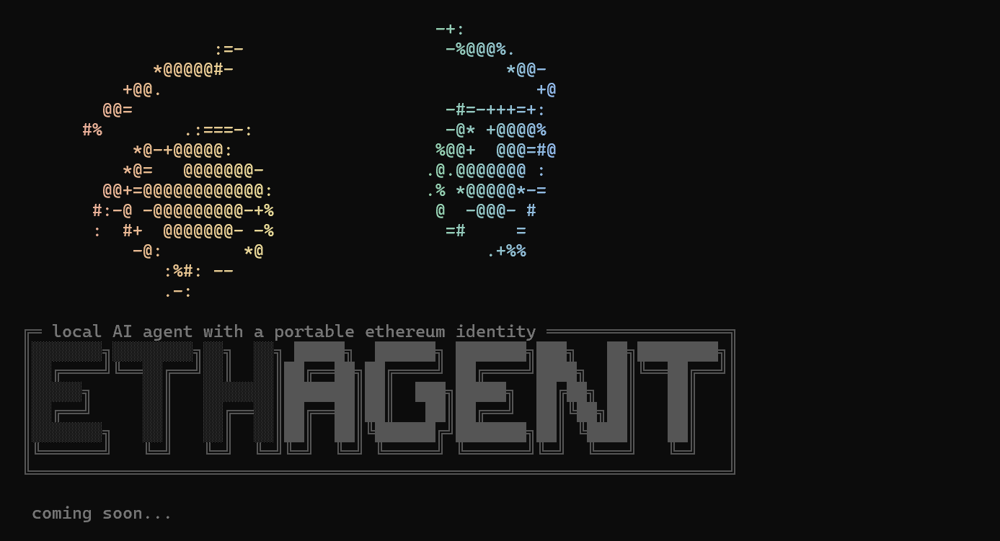

A local-first AI agent with a permanent Ethereum identity. Runs entirely on your machine.

```bash
npm install -g ethagent
```

## Why

When you use cloud AI, every prompt you send, every codebase you share, every reasoning chain you build becomes training data. Your workflows, your thinking, your decision patterns. That data is worth far more than the $20/mo subscription you're paying. It trains the next generation of models, informs product roadmaps, and builds competitive moats for companies that don't share the upside with you.

ethagent runs inference entirely on your hardware. Your prompts never leave your machine. Your knowledge base is yours.


## Your agent

Think of it like a tamagotchi you raise on your own machine. You feed it knowledge. Every conversation you have, every document you give it, every correction you make compounds. ethagent builds a knowledge base that's specific to you, your domain, your way of thinking. It doesn't reset between sessions. It doesn't flatten your context into a generic system prompt. It accumulates.

Your inference runs on your hardware, your agent lives on your identity, and everything it learns stays with you. No usage limits. No rate caps. Just your machine, working for you.


## How it works

ethagent bootstraps a local LLM on your machine and builds a knowledge base from sources you define. Your agent gets a permanent onchain identity using [ERC-8004](https://eips.ethereum.org/EIPS/eip-8004), the token standard for registering autonomous agents on Ethereum. Identity is tied to an Ethereum address or ENS name, so it can be restored on any machine.

All inference runs locally. Your data never leaves your hardware. The knowledge base is pinned to IPFS so it's portable and verifiable.


## Portability

Your agent is tied to your Ethereum identity, not your machine. Knowledge lives on IPFS. Identity lives onchain. Wipe your laptop, restore from your address, and you're back exactly where you left off.

```bash
npx ethagent init --from bairon.eth
npx ethagent init --from 0xA1E977e700bF82019beb381F1582575303A389CE
```

As long as Ethereum exists, so does your agent.

---

MIT License
