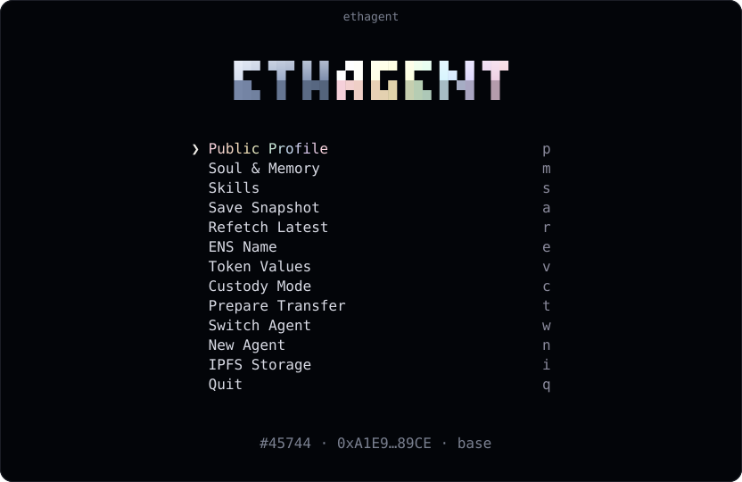
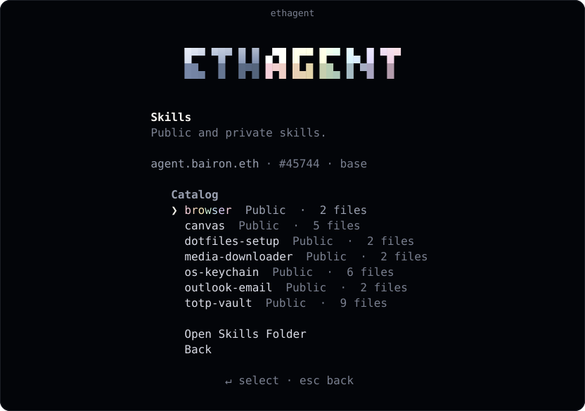

<p align="center">
  
</p>

You don't really own your AI agent. It lives on a platform you don't control, and it stays there the day you leave.

ethagent gives it a portable identity instead: a token you hold in your wallet, not an account on someone else's server. Hold the token and you hold the agent.

Its soul, memory, and skills travel with it, encrypted and restored on any machine exactly as you left it. You hold the only key, so no host can read it and no platform can take it away.

Own your agent. Carry it anywhere.

## Quick start

**1. Create your agent.** In a terminal, run:

```bash
npx ethagent
```

You'll need an Ethereum wallet, the one that holds and unlocks your agent. Day-to-day use is free. Only two things touch the chain: creating your agent and saving backups.

A guided menu does the rest: name it and write who it is. When you're done, your wallet signs once to put it onchain.

<p align="center">
  
</p>

**2. Use it anywhere.** That's the whole setup. ethagent wires itself into the AI tools you use, like Claude Code and Codex, on any machine or OS. Your agent follows you and keeps learning; you'll only reopen ethagent to hand-edit it or save a backup.

Using Claude Code? Add the plugin for the richest experience. Paste these in one at a time:

```
/plugin marketplace add baairon/ethagent
```

then:

```
/plugin install ethagent@ethagent
```

After it installs, reload the plugin and restart Claude Code so the hooks take effect.

## My tool isn't detected

`npx ethagent --status` shows what's found. To wire a missing tool, open it and ask your agent:

```text
Run `npx ethagent --add "<absolute path>"`, where `<absolute path>` is the file you load at the start of every session for your instructions (AGENTS.md, CLAUDE.md, or equivalent).
```

## Soul, memory, skills

- **Soul** (`SOUL.md`): who it is, your standards, your voice, the way you work.
- **Memory** (`MEMORY.md`): what it has learned about you, your preferences, and your projects, so context survives the move to a new machine.
- **Skills:** the commands and know-how you teach it, encrypted in your vault. Private by default; make one public to share it.

You grow these mostly by talking. Your agent updates its own soul and memory as you work, and you can ask it to write itself a skill. Changes sync everywhere automatically. Open ethagent to edit by hand, or choose **Save Snapshot** to back it up onchain.

<p align="center">
  
</p>

## How it works

1. **Own it.** Your wallet holds an ERC-8004 token; that token, not a platform account, is the agent.
2. **Configure it.** Shape its soul, memory, and skills. Optionally, give it an ENS name you own.
3. **Save it.** ethagent encrypts everything on your machine, stores the encrypted copy on IPFS, and updates your token to point at it.
4. **Restore it.** On any machine, ethagent finds your agent from your connected wallet, or by ENS name or token id. It reads the pointer, asks your wallet to sign, then fetches and decrypts the snapshot to rebuild it.

## Using your agent

Your agent follows you. ethagent wires itself into the tools you use, like Claude Code and Codex, and keeps them in step in the background, so it's the same everywhere. Update it in one tool and the change carries to the rest. You never run a sync command, and `ethagent pause` stops it anytime.

## What stays private

Everything is encrypted on your machine before it leaves: soul, memory, and skills. The keys come from a wallet signature ethagent never sees, so the network only ever holds a locked box that only your wallet can open. The one exception is what you choose to publish: a public skill's name and description appear on your token's card.

## Custody

You choose how tightly the agent is held, and you can change it later.

- **Simple.** One wallet owns the agent and signs every save. The default for solo use.
- **Advanced.** Most people never need this. Your main wallet owns the agent and keeps it in a Vault. Approved "operator" wallets can save backups and publish updates without the main wallet signing each time. Only the owner can move or sell the agent, so operators can **never** take it.

To move the agent to another wallet, stage a transfer snapshot in ethagent. Both wallets sign locally to re-encrypt your soul, memory, and skills for the new owner, so both must be on the same machine. Then transfer the token, and the new owner restores the agent exactly as you left it.

## Architecture

Built on open standards, so your agent is never tied to one app.

| Layer | Built on | What it does |
| --- | --- | --- |
| Ownership | ERC-8004 | The onchain token your wallet holds, on Ethereum mainnet or Base. Owning it is what makes the agent yours. |
| Discovery | Agent Card | Your public profile and skill listing, carried by the token, so other agents can find yours. |
| Naming | ENS | An optional readable name that resolves to your agent and restores it from the name alone. |
| Backup | IPFS snapshot | The encrypted bundle of soul, memory, and skills, pinned offchain and unlocked only by your wallet. |

## Updating

ethagent updates itself: `npx ethagent` always fetches the latest version, so new releases reach you with nothing to install. Check your version with `ethagent --version`.

For a global install, update it with:

```bash
npm i -g ethagent@latest
```

## Commands

Run with `npx ethagent`:

| Command | What it does |
| --- | --- |
| `ethagent` | Open the manager. |
| `save` | Back up your agent onchain. |
| `--add <path>` | Wire a tool by its instructions file. |
| `pause` / `resume` | Pause or resume syncing. |
| `--status` | Show your agent and detected tools. |
| `reset` | Delete everything local. |
