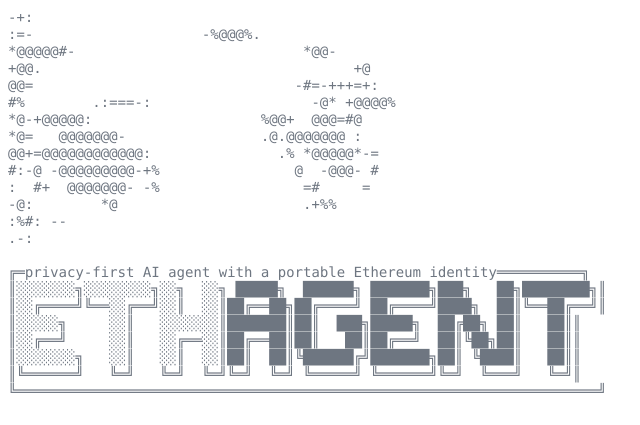

<p align="center">
  
</p>

Your AI agent runs on everything you've taught it: the instructions you've written, the preferences you've tuned, the context it has about your projects. Move to a new harness, swap models, or switch machines, and none of it follows. You start over from scratch, every time.

`ethagent` gives your agent a portable identity it carries everywhere: a token you hold in your wallet, not an account on someone else's server. Own the token and you own the agent. Its soul, memory, and skills travel with it, encrypted, backed up, and unlocked only by your wallet. Set it up once and it restores itself on any machine, exactly as you left it.

## ⚡ Quick start

Create your agent — no install required. `npx` downloads and runs `ethagent` on demand, so open a terminal and run

```bash
npx ethagent
```

This opens an interactive menu that walks you through every step that needs a wallet signature: mint the token, name it, write its soul, add skills, and save a snapshot.

To have it load automatically at the start of every Claude Code session, enable the plugin once:

```
/plugin marketplace add baairon/ethagent
/plugin install ethagent@ethagent
/reload-plugins
```

From then on, your agent loads with nothing else to configure.

## 📝 What you configure

Your agent is three core files you shape over time, and they travel with it:

- **Soul** (`SOUL.md`): who it is, your standards, your voice, the way you like to work.
- **Memory** (`MEMORY.md`): what it has learned about you and your projects, so hard-won context survives a move to a new machine.
- **Skills:** the commands, tools, and prompts you teach it. Mark a skill public and other agents can discover it; the rest stay private.

Everything is configured through `npx ethagent` — an interactive menu that walks you through writing your soul, growing your memory, and managing your skills, one step at a time.

## ⚙️ How it works

1. **Own it.** Mint an agent token your wallet holds. The token, not a platform account, is what the agent belongs to.
2. **Configure it.** Write its soul, grow its memory, add skills, and give it a name under an ENS name you own.
3. **Save it.** `ethagent` encrypts everything on your machine, pins the bundle to IPFS, and updates a pointer onchain. Only your wallet can unlock it.
4. **Restore it.** On any machine, `ethagent` reads that pointer, asks your wallet to sign, and rebuilds your agent in seconds, found by its ENS name or token id.

## 🔄 Across your tools

`ethagent` keeps your soul, memory, and skills in sync with Claude Code automatically. The plugin loads your agent on every session start and stays current as you work — no commands, no setup, nothing to wire up.

Syncing keeps Claude Code current; it doesn't back anything up. To save your changes for good, run `npx ethagent` and choose Save Snapshot. That step needs your wallet.

## 🔒 What stays private

Everything is encrypted on your machine before it leaves: `SOUL.md`, `MEMORY.md`, and every skill, public or private. The keys come from a wallet signature `ethagent` never sees, and that signature never spends funds. Marking a skill public does not decrypt it; it only lists the skill's name and description in the Agent Card carried by your token onchain, so other agents can discover it.

## 🔑 Custody

You choose how tightly the agent is held, and you can change your mind later.

- **Simple.** One wallet owns the agent and signs every save. The right default for solo use.
- **Advanced.** An owner wallet holds the agent in a Vault, and operator wallets can save snapshots and refresh skills without an owner signature each time. The Vault exposes only that one lane, so operators can never transfer your agent.

To hand the agent to someone else, transfer the token to their wallet; its soul, memory, and skills go with it, and they restore it exactly the way you would.

## Architecture

`ethagent` is built on open standards, so your agent is never tied to one tool.

| Layer | Built on | What it does |
| --- | --- | --- |
| Ownership | ERC-8004 | The onchain token your wallet holds; owning it is what makes the agent yours. |
| Discovery | Agent Card | Your public skill listing, carried by the ERC-8004 token, so other agents can find and call yours. |
| Naming | ENS | A human-readable name that resolves to your agent and restores it from the name alone. |
| Backup | IPFS snapshot | The encrypted bundle of soul, memory, and skills, pinned offchain and unlocked only by your wallet. |

## Commands

| Command | What it does |
| --- | --- |
| `ethagent` | Open the interactive identity manager. |
| `ethagent --sync` | Sync your soul, memory, and skills with every tool it detects. |
| `ethagent --sync-to=<path>` | Write per-skill folders under a custom path instead. |
| `ethagent --sync-list` | List the harnesses ethagent detects on this machine. |
| `ethagent --status` | Print a one-line identity summary. |
| `ethagent --demo` | Walk the identity manager with synthetic data, no wallet needed. |
| `ethagent reset` | Delete local identity, continuity, and secrets, remove ethagent's block from Claude Code, and clean up installed skills. |
