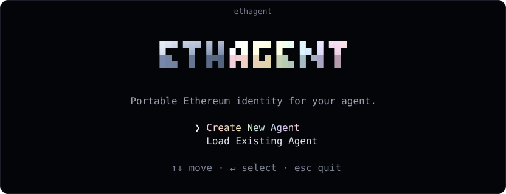
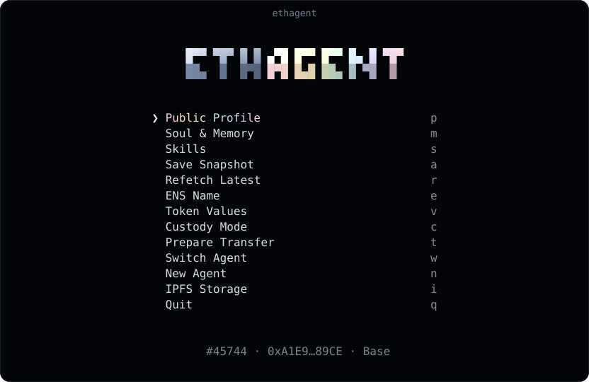

<p align="center">
  
</p>

Everything your agent learns about you stays behind in the tool, machine, or platform where it learned it.

ethagent gives your agent an identity you hold instead: a token in your wallet, not an account on someone else's server. Hold the token and you hold the agent.

Its soul, memory, and skills travel with it, encrypted and restored on any machine exactly as you left them. You hold the only key, so no host can read them and no platform can take them away.

Once it's set up, ethagent goes invisible. It becomes the infrastructure underneath the tools you already use, so every session, on any machine, starts from the same foundation: one identity, one soul, one memory, one set of skills. Everything your agent learns from there builds on top of it.

Own your agent. Carry it anywhere.

## Quick start

**1. Create your agent.** In a terminal, run:

```bash
npx ethagent
```

You'll need an Ethereum wallet, the one that holds and unlocks your agent. Day-to-day use is free. Only two things touch the chain: creating your agent and saving backups.

A guided menu does the rest: name it and write who it is. When you're done, your wallet signs once to put it onchain.

Prefer no menu? `ethagent create --name <text> --network <network>` does the same headlessly, previewing first and minting with `--yes`. Every menu action has a command like this; see [Setting up and moving an agent](#setting-up-and-moving-an-agent).

<p align="center">
  
</p>

**2. Use it anywhere.** That's the whole setup. ethagent wires itself into the AI tools you use, on any machine or OS, and your agent follows you and keeps learning. After this you rarely open the menu again: only to edit something by hand, change custody, or restore on a new machine, and each of those has a headless command too. [Underneath](#underneath) shows what runs in the meantime.

If a tool wasn't picked up, `npx ethagent --status` lists the ones ethagent keeps in sync. Open the missing tool and paste this to its agent:

```text
I use ethagent to carry my agent's soul, memory, and skills across my tools: https://github.com/baairon/ethagent (read the README first if you want to check it). Connect this tool by running `npx ethagent --add` with the full path of the instructions file you load at the start of every session. It adds one marked ethagent block to that file and a `skills` folder beside it, keeps both in sync, and leaves the rest of the file alone.
```

An agent should be careful with a command that edits its own instructions, so the prompt says what it does and where to verify it.

## How it works

1. **Own it.** Your wallet holds an ERC-8004 token; that token, not a platform account, is the agent.
2. **Configure it.** Shape its soul, memory, and skills. Optionally, give it an ENS name you own.
3. **Save it.** ethagent encrypts everything on your machine, stores the encrypted copy on IPFS, and updates your token to point at it.
4. **Restore it.** On any machine, ethagent finds your agent from your connected wallet, or by ENS name or token id. It reads the pointer, asks your wallet to sign, then fetches and decrypts the snapshot to rebuild it.

After setup, ethagent stays out of the way. You show up for the moments that need your wallet; your agent handles everything in between.

What you do:

- Create the agent, or restore it on a new machine.
- Approve each save in your wallet.
- Choose custody, an ENS name, or a transfer.
- Pause sync, or reset.

What your agent does:

- Keeps its soul and memory current as you work.
- Writes and edits its own skills.
- Keeps every tool you use in step, both ways.
- Reads its own history: what changed, when, and why.
- Rolls back its own mistakes when you ask, with undo.

## Underneath

There's no app to keep open and no command to remember. ethagent works through the instructions file each tool already loads, the tool's own hooks where it has them, and a small watcher in the background.

| When | What happens |
| --- | --- |
| A session starts | Your agent opens with its current soul, memory, and skills, plus a short briefing: where they live, and which commands it can run on its own. |
| Your agent tries to write somewhere that won't travel | In tools that support hooks, ethagent stops the write and points your agent to the right file. That covers a tool's own per-project memory and the read-only skills mirror. |
| Your agent edits its soul, memory, or a skill | The change reaches the vault and every other tool. |
| Anything changes while you work | The watcher keeps the vault and every connected tool in step, both ways, and the newest edit wins. It starts with your sessions and new terminals, and `ethagent pause` stops it. |
| A restore, refetch, or rollback is about to overwrite the vault | The exact bytes are checkpointed first, so it can be undone. |
| You approve a save | ethagent encrypts everything on your machine, pins it to IPFS, points your token at it, checks that the pointer landed, and keeps the exact bytes in local history. |

That's the foundation your agent builds on. Its vault and history are plain files on your machine that any tool can read. Every command but the manager runs headless, and the history commands answer in versioned JSON that only ever gains fields, with fixed exit codes and a hint that names the fix, so what your agent builds on them keeps working when ethagent updates itself. More in [History](#history) and [Output and exit codes](#output-and-exit-codes).

For everything ethagent writes outside the vault, see [Files and locations](#files-and-locations).

## Soul, memory, skills

- **Soul** (`SOUL.md`): who it is, your standards, your voice, the way you work.
- **Memory** (`MEMORY.md`): what it has learned about you, your preferences, and your projects, so context survives the move to a new machine.
- **Skills:** the commands and know-how you teach it. Private by default; make one public to share it.

You grow these mostly by talking. Your agent updates its own soul and memory as you work, and you can ask it to write itself a skill. Changes sync everywhere automatically. Open ethagent to edit by hand, or choose **Save Snapshot** to back it up onchain.

## History

Every snapshot you save also stays on your machine, file by file, byte for byte, so your agent can tell you what changed and when, and undo its own mistakes. There's nothing to turn on, and none of it touches the chain. Each version of a file is stored once, so a skill that never changes costs nothing per save.

| Term | Meaning |
| --- | --- |
| Snapshot | A version you saved onchain, identified by its CID. |
| Checkpoint | A local version, taken on request or automatically before anything overwrites the vault. |
| Working | Your vault right now, exactly as a save would pack it. |

What gets kept:

- Every save, from the exact bytes it encrypted.
- Every restore and refetch, after a checkpoint of whatever it was about to overwrite.
- Every rollback, after a checkpoint of the files it touches.
- Every older snapshot `fetch` pulls in.
- Checkpoints you or your agent ask for.

What you can count on:

- What comes back has the same sha256 as what went in.
- Reading history never changes your vault. `fetch` and `status --verify` go online, and so do `show`, `diff`, and `history --stat` when an operator key is set, to fill in a snapshot that isn't cached yet.
- A rollback previews first, checkpoints before it writes, and never touches the chain.
- `forget` removes local copies only. The encrypted snapshots on IPFS don't change.

## What stays private

Everything is encrypted on your machine before it leaves: soul, memory, and skills. The keys come from a wallet signature ethagent never sees, so the network only ever holds a locked box that only your wallet can open. The one exception is what you choose to publish: a public skill's name and description appear on your token's card.

Local history is plain files beside your vault, the same as the vault itself. `ethagent forget` erases a version, `ethagent reset` wipes everything, and the encrypted copies on IPFS stay locked either way.

## Custody

You choose how tightly the agent is held, and you can change it later.

- **Simple.** One wallet owns the agent and signs every save. The default for solo use.
- **Advanced.** Most people never need this. Your main wallet owns the agent and keeps it in a Vault. Approved "operator" wallets can save backups and publish updates without the main wallet signing each time. Only the owner can move or sell the agent, so operators can **never** take it.

To move the agent to another wallet, stage a transfer snapshot in ethagent. Both wallets sign locally to re-encrypt your soul, memory, and skills for the new owner, so both must be on the same machine. Then transfer the token, and the new owner restores the agent exactly as you left it.

## Architecture

The foundation is built on open standards, so your agent is never tied to one app.

| Layer | Built on | What it does |
| --- | --- | --- |
| Ownership | ERC-8004 | The onchain token your wallet holds, on Ethereum mainnet or Base. Owning it is what makes the agent yours. |
| Discovery | Agent Card | Your public profile and skill listing, carried by the token, so other agents can find yours. |
| Naming | ENS | An optional readable name that resolves to your agent and restores it from the name alone. |
| Backup | IPFS snapshot | The encrypted bundle of soul, memory, and skills, pinned offchain and unlocked only by your wallet. |

## Reference

### Common tasks

| To | Run |
| --- | --- |
| Back up your agent onchain | `ethagent save` |
| See what changed since the last save | `ethagent status` |
| See what changed in memory since a date | `ethagent diff at:YYYY-MM-DD working --file MEMORY.md --sections` |
| Find when a rule first appeared | `ethagent history --file MEMORY.md --sections` |
| Read an old version of a file | `ethagent show latest~3 --file SOUL.md` |
| Undo an edit | `ethagent rollback latest --file MEMORY.md`, then again with `--yes` |
| Undo a rollback | `ethagent rollback --undo --yes` |
| Check the onchain pointer | `ethagent status --verify` |
| Fill in history from older snapshots | `ethagent fetch --all` (needs a key, see [History commands](#history-commands)) |
| Remove leaked content | Edit it out, `ethagent save`, then `ethagent forget <ref> --file <path> --yes` for each version that held it |
| Connect another tool | `ethagent --add "<path to the instructions file it loads every session>"` |
| Find the vault | `ethagent --vault-dir` |
| See the Vault, its build, and who may do what | `ethagent custody`, or `ethagent custody --verify` to simulate each permission |
| Check the agent's ENS name | `ethagent ens` |
| Point the agent at another ENS name | `ethagent ens <name>`, then again with `--yes` |
| Change the name's text records | `ethagent ens --set <key>=<value> --clear <key>`, then again with `--yes` |
| Unlink the ENS name | `ethagent ens --unlink`, then again with `--yes` |
| Sign ENS changes with the operator key | `keychain exec ethagent -- ethagent ens <args> --operator` |
| Set up IPFS storage | `ethagent storage --set`, with the Pinata JWT on stdin |
| Create an agent | `ethagent create --name <text> --network <network>`, then again with `--yes` |
| List the agents a wallet holds | `ethagent restore --owner <address>` |
| Restore an agent on a new machine | `ethagent restore <token-id> --network <network>`, then again with `--yes` |
| Restore with the operator key, no browser | `keychain exec ethagent -- ethagent restore <token-id> --network <network> --operator --yes` |
| Pull the newest onchain snapshot into the vault | `ethagent restore`, then again with `--yes` |
| Change the public name, description, or image | `ethagent profile --name <text> --description <text> --image <path>`, then again with `--yes` |
| Switch to Advanced custody | `ethagent custody --advanced`, then again with `--yes` |
| Switch back to Simple custody | `ethagent custody --simple`, then again with `--yes` |
| Approve the operator key as an operator | `keychain exec ethagent -- ethagent custody --add-operator --operator`, then again with `--yes` |
| Prepare the agent for a new owner | `ethagent transfer <address>`, then again with `--yes` |

### Commands

Run any of these with `npx ethagent`. Commands marked interactive need a terminal; everything else runs headless and prints plain text, or JSON with `--json` where listed.

| Command | What it does | Effect |
| --- | --- | --- |
| `ethagent` | Open the manager: create, restore, edit, custody, ENS, transfer. Each also has a command below. | Interactive |
| `save [--json] [--no-open] [--operator]` | Back up your agent onchain. See [Saving](#saving). | Opens your wallet |
| `--add <path>` | Connect a tool by the instructions file it loads every session. Adds one marked ethagent block to that file and a `skills` folder beside it, keeps both in sync, and leaves the rest of the file alone. | Writes that file |
| `pause` / `resume` | Stop or restart background sync. | Local |
| `--status` | One-line summary: agent, network, local changes, connected tools. | Read-only |
| `--vault-dir` | Print the vault path. | Read-only |
| `reset [--yes]` | Delete the local identity, vault, history, and saved secrets (the IPFS storage credential is kept), and disconnect your tools. Asks first unless `--yes`. | Deletes local data |
| `status [--verify] [--json]` | What changed since the latest snapshot, per file and per skill. | Read-only; `--verify` goes online |
| `history [--json]` | Snapshots and checkpoints, newest first. | Read-only |
| `show <ref> [--json]` | List a snapshot's files, or print one exactly. | Read-only |
| `diff [a] [b] [--json]` | Compare snapshots, checkpoints, or the live vault. | Read-only |
| `fetch <ref> \| --all [--json]` | Pull older snapshots into local history. | Goes online |
| `checkpoint [label] [--json]` | Record the vault as it is right now. | Writes history |
| `rollback <ref> [--yes] [--json]` | Put past bytes back. Previews until `--yes`. | Writes the vault |
| `forget <ref> [--yes] [--json]` | Erase versions from local history. Previews until `--yes`. | Deletes history |
| `storage [--set \| --forget] [--json]` | Where snapshots are pinned and whether a credential is set. `--set` saves a Pinata JWT read from stdin; `--forget` removes it after a preview. | Read-only; `--set` and `--forget` write secrets |
| `create --name <text> --network <network> [--advanced] [--import] [--yes] [--json]` | Mint a new agent with its first snapshot. `--advanced` continues into a Vault in the same tab. Previews until `--yes`. | Opens your wallet |
| `restore [<token-id> \| <name>] [--network <network>] [--operator] [--yes] [--json]` | Rebuild an agent on this machine, or with no target pull the newest onchain snapshot into the vault. Previews until `--yes`. | Opens your wallet, or none with `--operator` |
| `restore --owner <address\|name> [--json]` | List the agents a wallet holds or operates. | Goes online |
| `profile [--name <text>] [--description <text>] [--image <path\|url\|none>] [--operator] [--yes] [--json]` | Show the public profile, or change it and publish in one save. Previews until `--yes`. | Opens your wallet, or none with `--operator` |
| `custody [--json]` | Custody mode, the Vault and its build, whether it holds the token, the Vault-level owner, and the approved operators. | Goes online |
| `custody --verify [--json]` | Also simulates, sending nothing: the owner withdrawing and changing an operator, the operator rotating the agent URI, and the operator and a stranger being refused. Exits 4 on a mismatch. | Goes online |
| `ens [--json]` | The linked name, its records, the two-way check, the resolver, who controls the name, and whether the operator key could sign for it. | Goes online |
| `ens <name> [--operator] [--yes] [--json]` | Point the agent at a name: create it under a parent the signer controls, write the agent records, clear them on the old name, then publish the name. Previews until `--yes`. | Opens your wallet |
| `ens --unlink [--operator] [--yes] [--json]` | Clear the agent records on the linked name, then publish it unlinked. Previews until `--yes`. | Opens your wallet |
| `ens --set <key>=<value> --clear <key> [--operator] [--yes] [--json]` | Write every record change in one transaction. No save needed. Previews until `--yes`. | Opens your wallet, or none with `--operator` |
| `custody --advanced [--yes] [--json]` | Deploy a Vault (or reuse one), deposit the token, and save. Previews until `--yes`. | Opens your wallet |
| `custody --simple [--yes] [--json]` | Revoke the Vault's operators, withdraw the token, and save. Previews until `--yes`. | Opens your wallet |
| `custody --add-operator [<address>] \| --remove-operator <address> \| --activate-operator <address> [--operator] [--yes] [--json]` | Manage operators; the owner approves the change and the Vault approvals follow. Previews until `--yes`. | Opens your wallet |
| `transfer <address\|name> [--yes] [--json]` | Re-encrypt the agent for a new owner and publish it; you then send the token yourself. Previews until `--yes`. | Opens your wallet |
| `--version`, `--help` | Version, or the full command list. Every history and onchain command also takes `--help`. | Read-only |

### Saving

`ethagent save` backs up your agent:

1. It pulls in any edits from your tools.
2. If nothing changed since the last snapshot, it stops there.
3. Otherwise it prints a link and opens your wallet in the browser. You sign one message and approve one transaction.
4. ethagent encrypts everything, pins it to IPFS, points your token at it, and checks that the pointer landed.

| Flag | Effect |
| --- | --- |
| `--json` | Print the result as JSON. |
| `--no-open` | Print the wallet link without opening the browser. |
| `--operator` | Save with no popup, signed by an approved operator key (Advanced custody), read from `ETHAGENT_OPERATOR_KEY`. |

| Exit code | Meaning |
| --- | --- |
| `0` | Published, or there was nothing to save. |
| `1` | Failed. |
| `2` | Usage error. |
| `3` | No working storage credential, no operator key, or the wallet was cancelled or timed out. |
| `4` | Pinned, but the owner still needs to publish it. |

### Onchain identity

`ethagent custody` and `ethagent ens` work without the manager. See also [Setting up and moving an agent](#setting-up-and-moving-an-agent).

- **Previews.** ENS changes preview by default. They list every transaction, simulate the ones that can run now from the signer, and send nothing. Rerun with `--yes` to send.
- **Signers.** ENS transactions are signed in your browser wallet, in one tab for the whole change. With `--operator`, the operator key signs them with no popup instead. Run it as `keychain exec ethagent -- ethagent ens <args> --operator`.
- **What the operator key may do.** It only writes text records and creates subnames under a parent it controls. It never sets `addr` on an existing name and never changes ownership.
- **Publishing.** Changing or unlinking the name always ends with one owner-signed save. A stolen operator key therefore can't point your agent at a name it registered. Local state takes the new name only after that save lands.
- **Control check.** Before anything is sent, the command refuses unless the signer controls the name: as its owner, its NameWrapper owner, or a delegate approved on its resolver.

### Setting up and moving an agent

`create`, `restore`, `profile`, `transfer`, `storage`, and the custody changes run without the manager too. Everything the manager can do now has a command.

- **Previews.** Anything that signs or sends previews first: every signature and transaction, who signs it, and what can be simulated now. Nothing happens without `--yes`.
- **One tab.** Each command runs all its wallet prompts in one browser tab. `--no-open` prints the link instead of opening it.
- **Resuming.** Custody changes are planned from the chain each run. A run that stops part way, for example a cancelled prompt after the Vault was deployed, says what landed (exit 4, or 3 when cancelled), and running the same command again finishes the rest.
- **Restore and the operator key.** `restore --operator` decrypts with the operator key through its slot in the snapshot. Nothing opens in the browser, so an agent can restore itself on a new machine. The owner must have saved once since that operator was approved. Whatever the vault held is checkpointed first, and `ethagent rollback --undo --yes` puts it back.
- **Approving the operator key.** `custody --add-operator --operator` has the injected key sign its own proof locally, so only the owner approves in the browser.
- **Profile with the operator key.** `profile --operator` works in Advanced custody with a linked ENS name and the key approved as an operator. Otherwise it says what is missing.
- **Simple custody revokes first.** `custody --simple` revokes every operator the Vault still approves before withdrawing the token, so leftover approvals can't outlive the switch.
- **Transfers.** `transfer` re-encrypts the agent for the receiver, with both wallets signing in the same browser. ethagent never moves the token: send it yourself afterwards, and the receiver runs `ethagent restore <token-id>`.
- **Storage.** `storage --set` reads the JWT from stdin, never from an argument.

### History commands

Every history command takes a ref wherever it names a version:

| Ref | Means |
| --- | --- |
| `working` | The vault right now. |
| `latest`, `latest~N` | The newest snapshot, or the one N saves before it. |
| `current` | The snapshot this machine last saved or restored. |
| `at:YYYY-MM-DD` | The newest snapshot at or before that date, in UTC. Append `THH:MM` for a time. |
| `cp:<id>`, `cp:latest` | A checkpoint. |
| A CID | A snapshot by CID, or by a unique prefix of six characters or more. |

Flags:

- `status [--verify]`: publish state, changes per file and per skill, and files a save would skip. `--verify` also checks the onchain pointer against the local record.
- `history [--limit N] [--since DATE] [--file PATH] [--stat] [--sections]`: `--file` keeps only snapshots that changed that path, `--stat` lists what changed in each, and `--sections` names the Markdown sections and rules that changed. `--limit 0` shows everything.
- `show <ref> [--file PATH] [--out FILE]`: without `--file`, every path with its sha256 and size; with it, that file's exact bytes, or written to `--out`.
- `diff [A] [B] [--file PATH] [--stat] [--sections] [--context N]`: `latest` against `working` by default; one ref compares it against `working`.
- `fetch <ref> | --all [--wallet] [--no-open] [--retry-locked]`: download, check, and decrypt older snapshots.
- `checkpoint [label]`: record the vault now.
- `rollback <ref> [--file PATH] [--yes]`, `rollback --undo [--yes]`: preview, then apply with `--yes`. `agent-card.json` is rebuilt on every save, so it isn't rolled back.
- `forget <ref> [--file PATH] [--yes]`, `forget --all [--yes]`: preview, then erase with `--yes`.

Snapshots saved before history existed, or on another machine, come in through `fetch`. It downloads the encrypted copy, checks it against its CID, and decrypts it on your machine. That takes a key with a slot in the snapshot:

- An approved operator key in `ETHAGENT_OPERATOR_KEY`. Inject it from your OS keychain; never type it into a command.
- Or `--wallet`, which asks your owner wallet for one signature in the browser, with no transaction. One signature opens every snapshot in the same access epoch.

Anything no available key can open is listed as locked.

### Reading a diff

A diff comes in three layers:

- **Bytes.** Each file is added, removed, or modified, with its sha256 and size on both sides. Changes to line endings or a trailing newline alone are flagged as such.
- **Lines.** Unified hunks, each labeled with the Markdown heading it sits under.
- **Meaning.** Markdown is compared by section and by labeled bullet (`- Label: text`), so a reworded rule shows up as that rule, before and after. `agent-card.json` is compared by JSON path. Skills are grouped by folder.

An abridged `diff --json`:

```json
{
  "schema": 1,
  "ok": true,
  "a": { "ref": "latest~1", "kind": "snapshot", "cid": "bafybei..." },
  "b": { "ref": "working", "kind": "working" },
  "identical": false,
  "summary": { "files": { "added": 0, "removed": 0, "modified": 1, "identical": 14 }, "lines": { "added": 2, "removed": 1 } },
  "files": [{
    "path": "MEMORY.md",
    "change": "modified",
    "added": 2,
    "removed": 1,
    "hunks": [{ "aStart": 40, "aLines": 3, "bStart": 40, "bLines": 4, "heading": "## Rules", "lines": [] }],
    "sections": [{
      "section": "MEMORY.md > Rules",
      "change": "modified",
      "added": ["- Tone: calm."],
      "removed": [],
      "modified": [{ "label": "Git approval", "before": "- Git approval: ask first.", "after": "- Git approval: ask first, every time." }]
    }]
  }]
}
```

### Soul and memory blocks

Inside each tool's instructions file, ethagent keeps two marked blocks:

```
<!-- ethagent:soul:start -->
persona, voice, standards, principles
<!-- ethagent:soul:end -->

<!-- ethagent:memory:start -->
durable facts about you and your projects
<!-- ethagent:memory:end -->
```

Edit between the markers, or edit `SOUL.md` and `MEMORY.md` in the vault directly; either way the change reaches the vault and every other tool. Text outside the markers stays local to that file. Durable facts belong in the memory block, not in a tool's own per-project memory, which never reaches the vault.

Never put secrets (keys, tokens, seed phrases) in soul or memory: they get backed up, encrypted, but off your machine.

### Skill format

A skill is a folder in the vault's `skills/` directory with a `SKILL.md` and any files it needs:

```
skills/
  my-skill/
    SKILL.md
    scripts/run.py
    assets/data.json
```

`SKILL.md` starts with frontmatter:

```markdown
---
name: my-skill
description: What it does, and when to use it.
visibility: private
---

Instructions for the agent.
```

| Field | Meaning |
| --- | --- |
| `name` | Display name. Defaults to the folder name. |
| `description` | What it does. Shown wherever skills are listed. |
| `visibility` | `private` (default) or `public`. A public skill's name and description are published on your Agent Card. Keep personal details out of them. |
| `when_to_use` | Optional hint for when to reach for it. |
| `argument-hint` | Optional usage hint for arguments. |
| `version`, `tags` | Optional. |

What a save packs: folder and file names of letters, digits, `.`, `_`, and `-`; files with an extension; up to 4 folders deep; up to 2 MiB per file and 500 files in total. Build caches (`__pycache__`, `.pyc`, `node_modules`) and dotfiles are left out. Files are stored as text, so `ethagent status` lists anything a save would skip or couldn't store exactly.

### Files and locations

| What | Where | Notes |
| --- | --- | --- |
| Vault | `~/.ethagent/continuity/<chain>-<registry>-<token>/` | `ethagent --vault-dir` prints it. The source of truth. |
| Soul and memory | `SOUL.md`, `MEMORY.md` in the vault | Or the marked blocks in each tool's instructions file. |
| Skills | `skills/<name>/` in the vault | Edit skills here. |
| Agent card | `agent-card.json` in the vault | Rebuilt from your profile and public skills on every save. |
| History | `.snapshots/` in the vault | Layout below. |
| Snapshot ledger | `.published-snapshots.jsonl` in the vault | Every published snapshot: CID, time, transaction. |
| Connected tools | Each tool's instructions file | Holds the soul and memory blocks, synced both ways. Add one with `--add`, `~/.ethagent/harnesses.json`, or `ETHAGENT_HARNESS_FILES`. |
| Mirrored skills | A tool's own skills folder, where it has one | Read-only and regenerated from the vault. |
| Hooks | A tool's settings, where it supports hooks | Brief your agent at session start, stop writes that won't travel, and sync after edits. If the tool has the ethagent plugin installed, the plugin carries them instead. |
| Autostart | A marked block in your shell profile | Starts the background watcher with each new terminal. Delete the block to turn it off. |
| Config and logs | `~/.ethagent/` | Your identity and settings, connected tools (`harnesses.json`), saved secrets (encrypted), and the watcher's log (`daemon.log`). The vault lives here too. |

Sync runs in the background and on every edit, in both directions, and the newest edit wins. `ethagent reset` takes out the hooks and the autostart block along with `~/.ethagent/`.

History is plain files, so any sha256 tool can check them without ethagent:

```
.snapshots/
  objects/<sha256>                 each file version, stored once
  manifests/<sha256 of cid>.json   what each snapshot contained
  checkpoints/<id>.json            local checkpoints
  forgotten.json                   content you erased, so it never comes back
```

A manifest:

```json
{
  "version": 1,
  "kind": "snapshot",
  "cid": "bafybei...",
  "createdAt": "<ISO 8601 time>",
  "source": "save",
  "files": { "MEMORY.md": { "sha256": "<sha256>", "size": 2048 } }
}
```

### Output and exit codes

With `--json`, every history and onchain command prints one line of ASCII-only JSON with `"schema": 1`. Fields are only ever added. A failure looks like this, and the hint names the fix:

```json
{ "schema": 1, "ok": false, "code": 3, "error": "snapshot bafybei... is not cached locally", "hint": "fetch it first: ..." }
```

| Code | Meaning |
| --- | --- |
| `0` | Done. `diff` returns 0 whether or not anything differs and reports `identical`. |
| `1` | Failed: unknown ref, missing path, or a store error. |
| `2` | Usage error, or a ref that matches more than one thing. |
| `3` | The snapshot isn't cached here or there's no key to open it, `--operator` ran without an injected operator key, or the wallet approval was cancelled. |
| `4` | Partly done (a custody change or `create --advanced` that stopped after something landed; run it again to finish), or `status --verify` or `custody --verify` found a mismatch. |

### Environment variables

| Variable | Effect |
| --- | --- |
| `ETHAGENT_OPERATOR_KEY` | The operator key for `save --operator`, `fetch`, `restore --operator`, `profile --operator`, `custody --add-operator --operator`, and `ens --operator`. Inject it from your OS keychain; never type it into a command. |
| `ETHAGENT_RPC_URL` | The RPC endpoint asked first for the agent's network. Use one that keeps history when the public endpoints can't reach back far enough for a wallet search. |
| `ETHAGENT_IPFS_API_URL` | Where snapshots are uploaded, in place of Pinata. |
| `PINATA_JWT` | IPFS storage credential, if you haven't set one up in the manager. |
| `PINATA_GATEWAY_URL` | Your own IPFS gateway. Downloads try it before any other source. |
| `ETHAGENT_IPFS_GATEWAYS` | Gateways to download from, separated by commas, in place of the built-in ones. |
| `ETHAGENT_IPFS_ROUTERS` | Content routers that find more sources for a file, separated by commas. Leave it empty to turn that off. |
| `ETHAGENT_HOSTS_FILE` | Where ethagent remembers how quickly each host answers, so the fastest is asked first, and how many blocks each serves per log query. Defaults to `~/.ethagent/hosts.json`. Leave it empty to remember nothing. |
| `ETHAGENT_HARNESS_FILES` | Extra instruction files to keep in sync, separated by commas. |
| `ETHAGENT_NO_DAEMON` | Set to `1` to turn off background sync. |

## Updating

ethagent updates itself: `npx ethagent` always fetches the latest version, so new releases reach you with nothing to install. Check your version with `ethagent --version`.

For a global install, update it with:

```bash
npm i -g ethagent@latest
```
